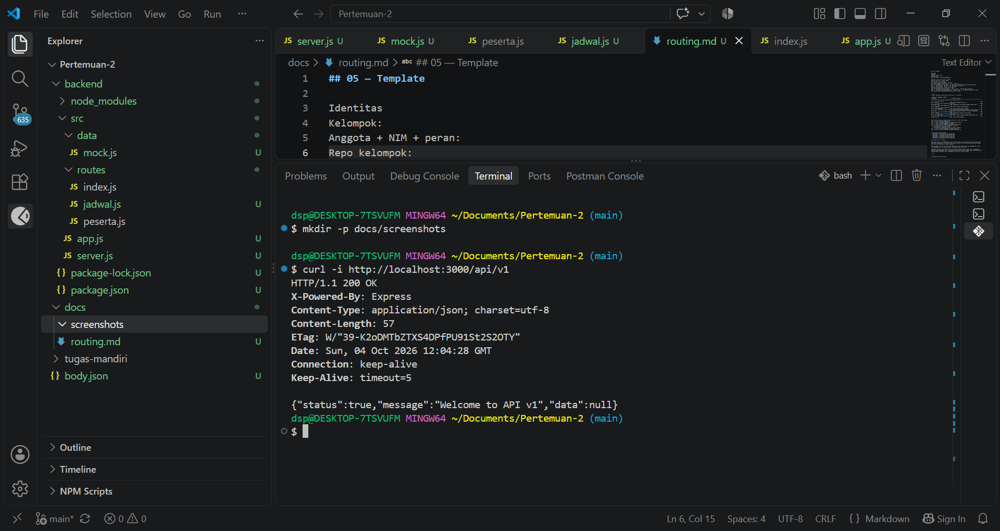
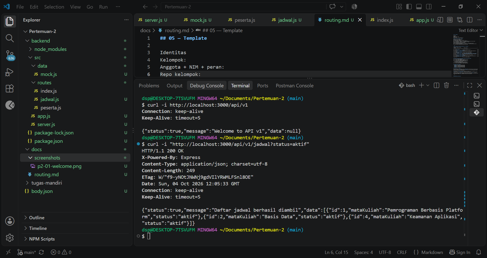
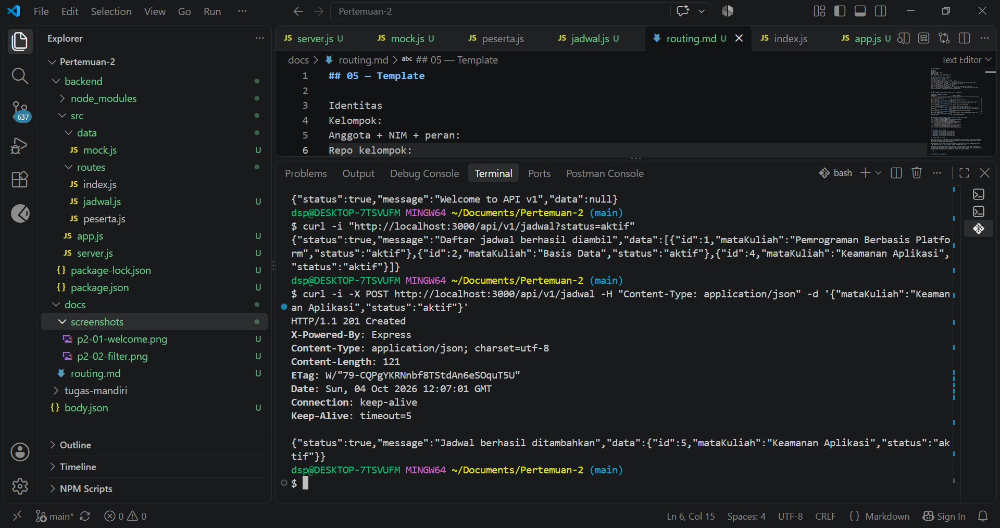
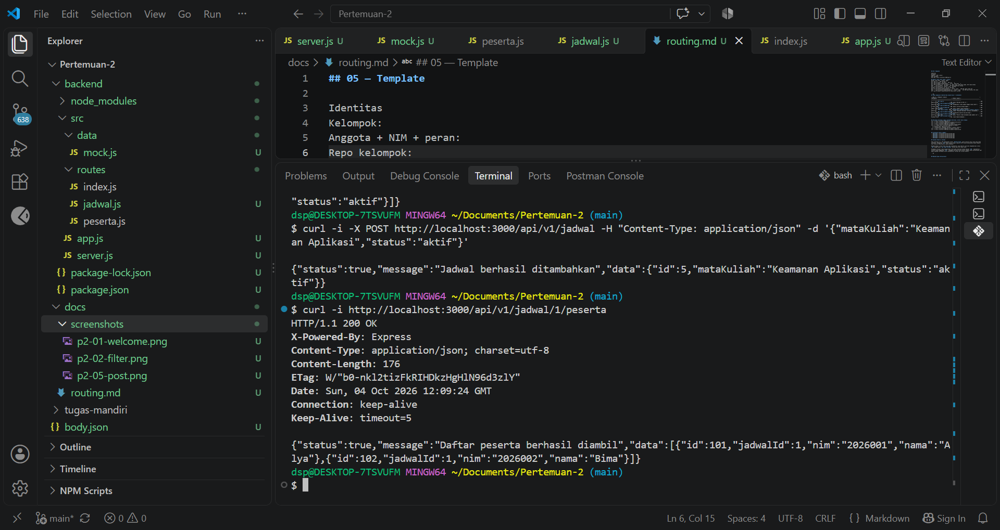
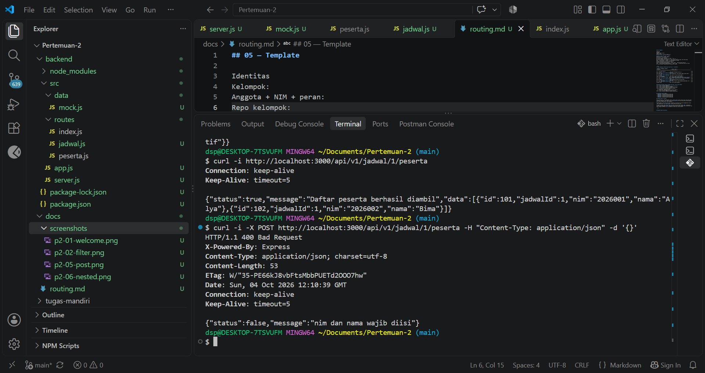

## 05 — Template

Identitas
Kelompok:
Anggota + NIM + peran:
Repo kelompok:
Base URL: http://localhost:3000/api/v1

## Daftar route (asal input + status)
Method	URL	Input	Sukses	Gagal
GET	/api/v1	—	200 welcome	—
GET	/api/v1/jadwal	req.query	200 list	—
GET	/api/v1/jadwal/jumlah-jadwal	array	200 total	—
GET	/api/v1/jadwal/:id	req.params.id	200 1 data	400 bukan angka, 404 tidak ketemu
POST	/api/v1/jadwal	req.body	201	400 mataKuliah kosong
PUT	/api/v1/jadwal/:id	params + body	200	404
DELETE	/api/v1/jadwal/:id	params	200	404
GET	/api/v1/jadwal/:jadwalId/peserta	params induk	200	404 induk tidak ada
POST	/api/v1/jadwal/:jadwalId/peserta	induk + body	201	400 body kosong, 404 induk
GET	/api/v1/jadwal/:jadwalId/peserta/:pesertaId	2 params	


```md
## Tabel pengujian step-by-step (wajib diisi + screenshot)

| **No.** | **Request (step)**                                                               | **Harapan**                            | **Hasil saya** |
| ------: | :------------------------------------------------------------------------------- | :------------------------------------- | :------------- |
|       1 | `GET /api/v1`                                                                    | 200 pesan welcome                      | 200, pesan "Welcome to API v1" |
|       2 | `GET /api/v1/jadwal?status=aktif`                                                | 200 hanya data aktif                   | 200, menampilkan 2 data jadwal dengan status aktif |
|       3 | `GET /api/v1/jadwal/abc`                                                         | 400 id harus angka                     | 400, pesan "id harus berupa angka" |
|       4 | `GET /api/v1/jadwal/99`                                                          | 404 jadwal tidak ditemukan             | 404, pesan "Jadwal tidak ditemukan" |
|       5 | `POST /api/v1/jadwal` body `{"mataKuliah":"Keamanan Aplikasi","status":"aktif"}` | 201 objek baru                         | 201, jadwal "Keamanan Aplikasi" berhasil ditambahkan |
|       6 | `GET /api/v1/jadwal/1/peserta`                                                   | 200 peserta jadwal 1                   | 200, menampilkan peserta Alya dan Bima |
|       7 | `GET /api/v1/jadwal/1/peserta/103`                                               | 404 peserta di jadwal lain             | 404, pesan "Peserta tidak ditemukan pada jadwal ini" |
|       8 | `GET /api/v1/alamat-salah`                                                       | 404 fallback route                     | 404, route tidak ditemukan |
```

## Perintah verifikasi cepat (jalankan berurutan, server harus hidup):
curl -s http://localhost:3000/api/v1
curl -s "http://localhost:3000/api/v1/jadwal?status=aktif"
curl -s http://localhost:3000/api/v1/jadwal/1
curl -s http://localhost:3000/api/v1/jadwal/jumlah-jadwal
curl -i -X POST http://localhost:3000/api/v1/jadwal \
  -H "Content-Type: application/json" \
  -d '{"mataKuliah":"Keamanan Aplikasi","status":"aktif"}'
curl -s http://localhost:3000/api/v1/jadwal/1/peserta
curl -s http://localhost:3000/api/v1/jadwal/1/peserta/101


## Screenshot wajib 5 gambar:
- 
- 
- 
- 
- 

## Catatan ATLAS vs latihan

Pada praktikum ini, API menggunakan status `404 Not Found` untuk resource atau route yang tidak ditemukan. Penggunaan `404` lebih sesuai dengan semantik HTTP karena menunjukkan bahwa endpoint atau resource yang diminta tidak ditemukan.

Berbeda dengan sistem ATLAS yang pada implementasi lama memiliki perilaku mengembalikan status `500` dengan pesan `Api tidak tersedia` ketika path API tidak cocok.

Perbedaan tersebut tidak mengharuskan route pada praktikum diubah menjadi `500`. Implementasi latihan tetap menggunakan `404`, sedangkan perilaku ATLAS dicatat sebagai bahan perbandingan agar dapat memahami perbedaan antara implementasi latihan dan sistem produksi.

```md


## Masalah yang sering muncul

| **Gejala**                                   | **Penyebab yang mungkin**                                      | **Perbaikan**                                                                 |
| :------------------------------------------- | :------------------------------------------------------------- | :----------------------------------------------------------------------------- |
| Server gagal berjalan setelah perubahan route | Terdapat kesalahan penulisan pada file `jadwal.js` saat menambahkan nested route | Memeriksa kembali kode `jadwal.js`, terutama bagian `require('./peserta')` dan `router.use('/:jadwalId/peserta', pesertaRouter)`, kemudian memperbaiki penulisannya |
| `EADDRINUSE: address already in use :::3000` | Tidak terjadi selama pengujian | — |
| `req.body` bernilai `undefined`              | Tidak terjadi selama pengujian | `express.json()` sudah dipasang pada `app.js` dan request dikirim dengan `Content-Type: application/json` |
| `/jumlah-jadwal` dibaca sebagai `id`         | Tidak terjadi selama pengujian | Route `/jumlah-jadwal` sudah ditempatkan sebelum route `/:id` |
| `req.params.jadwalId` bernilai `undefined`   | Tidak terjadi selama pengujian | Router peserta menggunakan `express.Router({ mergeParams: true })` |
| Semua route menghasilkan 404                 | Tidak terjadi selama pengujian | Prefix `/api/v1`, `/jadwal`, dan path lokal sudah dipasang dengan benar |
| Data tambahan hilang setelah restart         | Data disimpan di array memori | Hal ini sesuai dengan rancangan Pertemuan 2 karena data belum menggunakan database |
```
