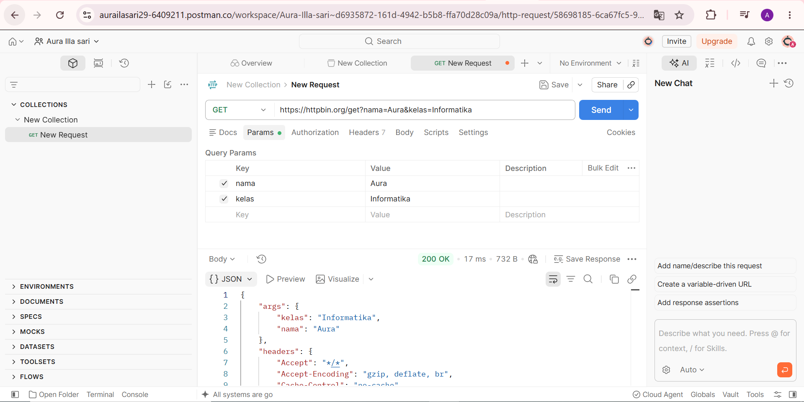
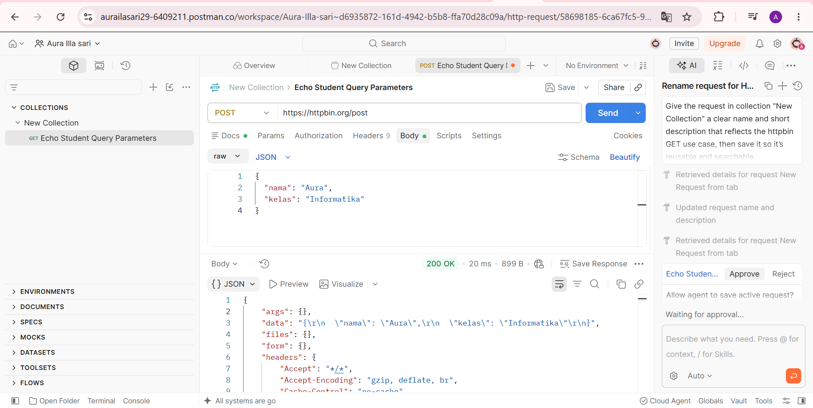
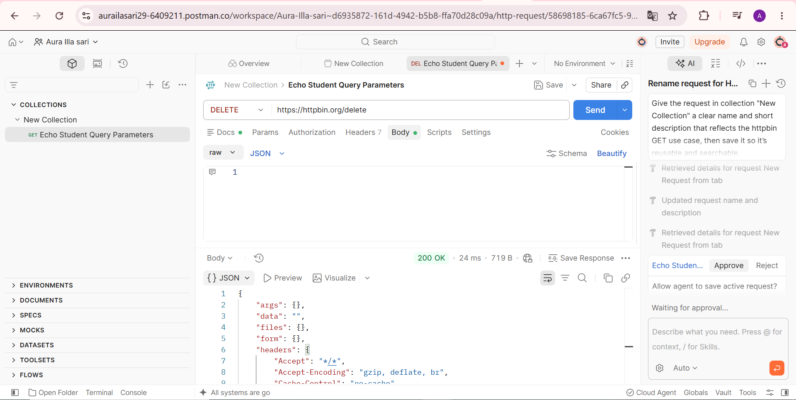

# Tugas Mandiri 1 — Mengenal HTTP Method dan Endpoint

## Pengujian HTTP Method

Pengujian dilakukan menggunakan Postman dengan layanan HTTPBin (`https://httpbin.org`) untuk memahami penggunaan method GET, POST, PUT, PATCH, dan DELETE.

| **No** | **Method** | **Endpoint** | **Data yang dikirim** | **Status** | **Hasil** |
| -----: | :--------- | :----------- | :-------------------- | ---------: | :-------- |
| 1 | GET | `/get` | Query parameter `nama=Aura&kelas=Informatika` | 200 | Server mengembalikan query parameter dan informasi request pada response. |
| 2 | POST | `/post` | JSON `{"nama":"Aura","kelas":"Informatika"}` | 200 | Server menerima dan mengembalikan data JSON pada response. |
| 3 | PUT | `/put` | JSON `{"nama":"Aura","kelas":"Informatika"}` | 200 | Server menerima dan mengembalikan data JSON pada response. |
| 4 | PATCH | `/patch` | JSON `{"nama":"Aura","kelas":"Informatika"}` | 200 | Server menerima dan mengembalikan data JSON pada response. |
| 5 | DELETE | `/delete` | - | 200 | Server menerima request DELETE dan mengembalikan informasi request. |

## Screenshot Postman

Minimal dua request sesuai instruksi tugas.

### GET

### POST

### DELETE

## Kesimpulan

Berdasarkan pengujian, kelima HTTP method berhasil diproses oleh HTTPBin dengan status `200 OK`. GET menggunakan query parameter, sedangkan POST, PUT, dan PATCH mengirim data melalui request body. DELETE digunakan untuk menguji request penghapusan tanpa mengirim body.