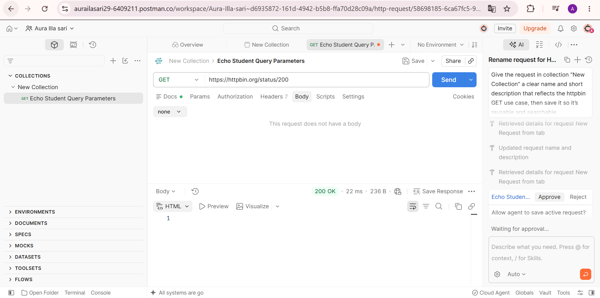
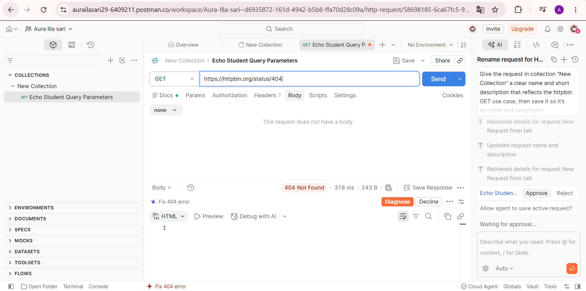
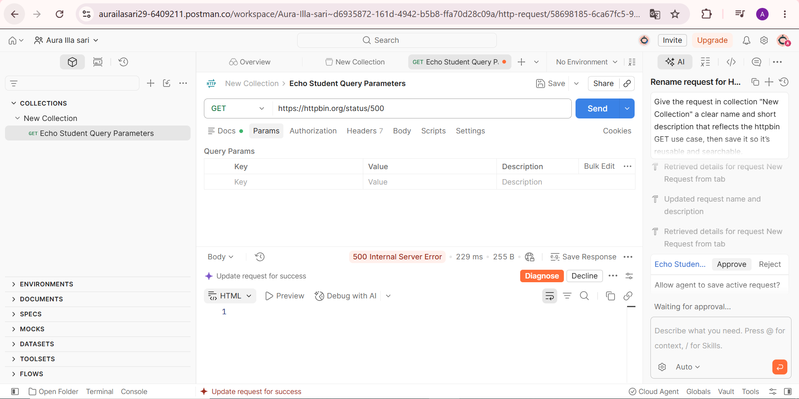

# Tugas Mandiri 2 — Memahami HTTP Status Code

## Pengujian Status Code

Pengujian dilakukan menggunakan Postman dengan layanan HTTPBin untuk memahami arti dan penggunaan berbagai HTTP status code.

| **Status Code** | **Arti** | **Hasil Pengujian** | **Kapan Digunakan** |
| --------------: | :------- | :------------------ | :------------------ |
| 200 | OK | Server mengembalikan status `200 OK` | Digunakan ketika request berhasil diproses. |
| 201 | Created | Server mengembalikan status `201 Created` | Digunakan ketika request berhasil dan menghasilkan resource baru. |
| 400 | Bad Request | Server mengembalikan status `400 Bad Request` | Digunakan ketika request yang dikirim tidak valid atau tidak dapat diproses. |
| 401 | Unauthorized | Server mengembalikan status `401 Unauthorized` | Digunakan ketika request membutuhkan autentikasi yang valid. |
| 403 | Forbidden | Server mengembalikan status `403 Forbidden` | Digunakan ketika server memahami request tetapi menolak memberikan akses. |
| 404 | Not Found | Server mengembalikan status `404 Not Found` | Digunakan ketika resource atau endpoint yang diminta tidak ditemukan. |
| 500 | Internal Server Error | Server mengembalikan status `500 Internal Server Error` | Digunakan ketika terjadi kesalahan pada sisi server. |

## Screenshot Pengujian

### Status Code 200

### Status Code 404

### Status Code 500

## Jawaban Pertanyaan

### 1. Apa perbedaan `400` dan `404`?
Status `400 Bad Request` menunjukkan bahwa request yang dikirim oleh client tidak valid atau tidak dapat diproses oleh server. Sedangkan `404 Not Found` menunjukkan bahwa endpoint atau resource yang diminta tidak ditemukan oleh server.

### 2. Apa perbedaan `401` dan `403`?
Status `401 Unauthorized` menunjukkan bahwa client belum memberikan autentikasi yang valid untuk mengakses resource. Sementara `403 Forbidden` menunjukkan bahwa client sudah dikenali atau request dapat dipahami, tetapi akses tetap ditolak oleh server.

### 3. Mengapa `500` menunjukkan masalah pada sisi server?
Status `500 Internal Server Error` menunjukkan bahwa terjadi kesalahan yang tidak dapat ditangani oleh server ketika memproses request. Kesalahan tersebut berasal dari proses atau kondisi internal server, bukan semata-mata karena request client.

### 4. Apakah semua error HTTP berarti server mengalami kerusakan?
Tidak. Tidak semua error HTTP berarti server mengalami kerusakan. Beberapa status error seperti `400`, `401`, `403`, dan `404` menunjukkan masalah pada request atau akses yang diminta client. Status `500` dan kelompok `5xx` secara umum menunjukkan masalah pada sisi server.

## Kesimpulan
Pengujian menunjukkan bahwa setiap HTTP status code memiliki arti dan fungsi yang berbeda. Status `2xx` menunjukkan keberhasilan request, sedangkan status `4xx` umumnya berkaitan dengan request atau akses dari client dan status `5xx` menunjukkan kesalahan pada sisi server.