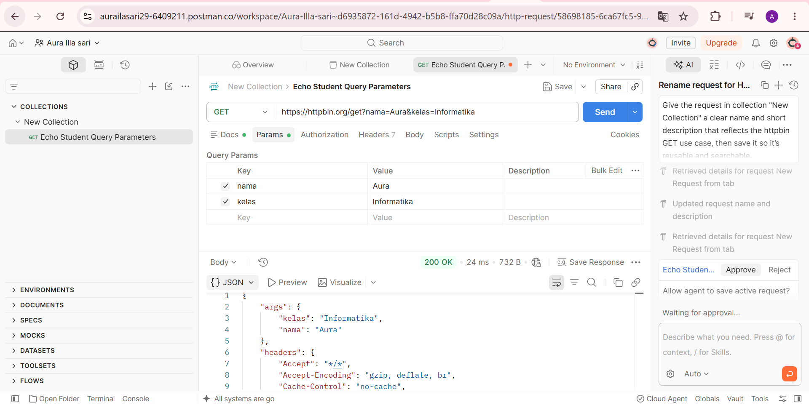
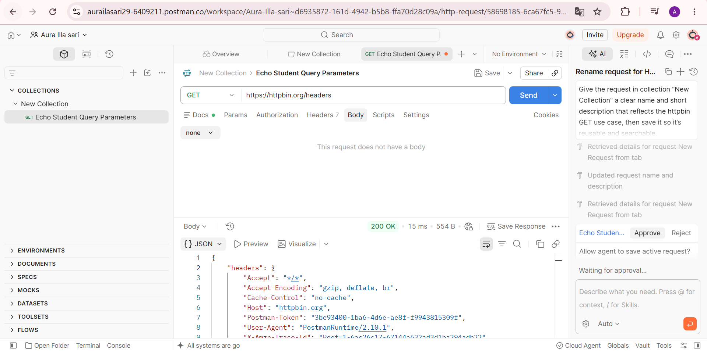

# Tugas Mandiri 3 — Memahami Request dan Response

## Pengujian Request dan Response
Pengujian dilakukan menggunakan Postman dan layanan HTTPBin untuk melihat informasi request yang dikirim oleh client dan response yang diberikan oleh server.

### 1. GET `/get`

URL yang digunakan:
`https://httpbin.org/get?nama=Aura&kelas=Informatika`

Hasil pengujian menunjukkan status `200 OK`. HTTPBin mengembalikan query parameter `nama` dan `kelas` pada bagian `args` serta informasi request lainnya.

### 2. GET `/headers`

URL yang digunakan:
`https://httpbin.org/headers`

Hasil pengujian menunjukkan status `200 OK`. HTTPBin mengembalikan informasi header yang diterima server, seperti `Accept`, `Host`, dan `User-Agent`.

## Jawaban Pertanyaan

### 1. Apa yang dimaksud request?
Request adalah permintaan yang dikirim oleh client kepada server untuk meminta atau mengirimkan suatu data.

### 2. Apa yang dimaksud response?
Response adalah balasan dari server setelah menerima dan memproses request dari client.

### 3. Apa fungsi query parameter?
Query parameter digunakan untuk mengirimkan informasi tambahan melalui URL sehingga server dapat menggunakan data tersebut dalam memproses request.

### 4. Apa fungsi HTTP header?
HTTP header digunakan untuk membawa informasi tambahan tentang request atau response, seperti jenis data, browser/client, dan aturan komunikasi.

### 5. Apa perbedaan data pada URL dengan data pada request body?
Data pada URL biasanya dikirim melalui query parameter dan dapat terlihat langsung pada alamat URL. Data pada request body dikirim di dalam isi request dan biasanya digunakan untuk mengirim data seperti JSON pada POST, PUT, atau PATCH.

## Kesimpulan
Request merupakan permintaan dari client, sedangkan response merupakan balasan dari server. Query parameter digunakan untuk mengirim data melalui URL, sedangkan HTTP header membawa informasi tambahan mengenai komunikasi antara client dan server.