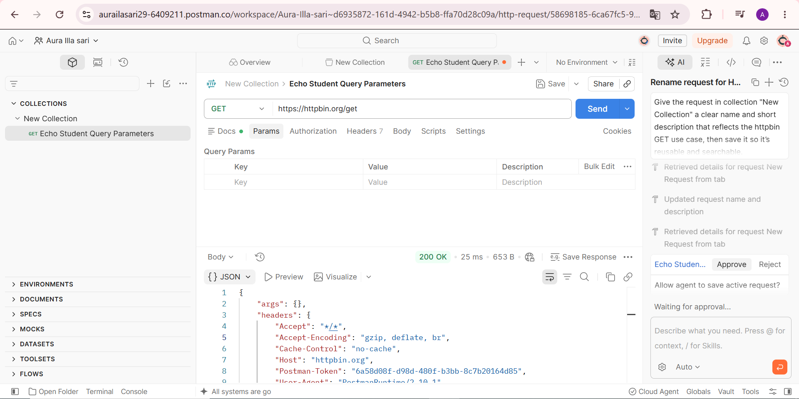
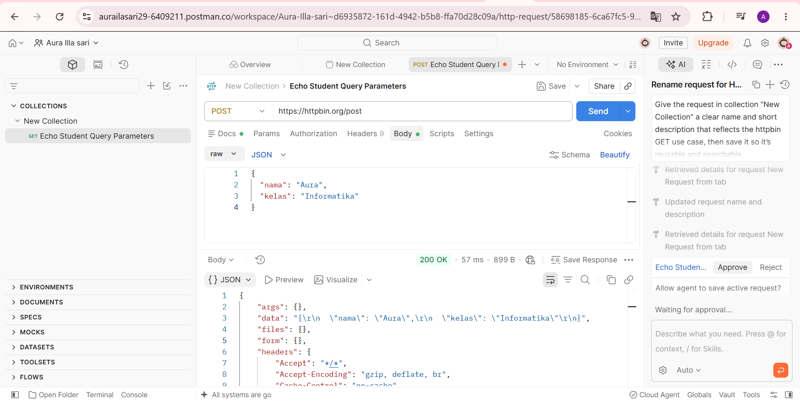
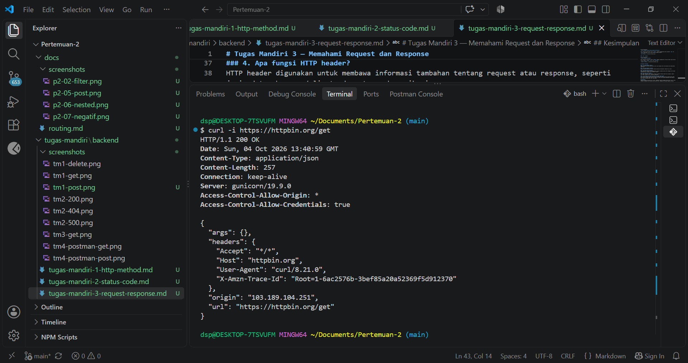
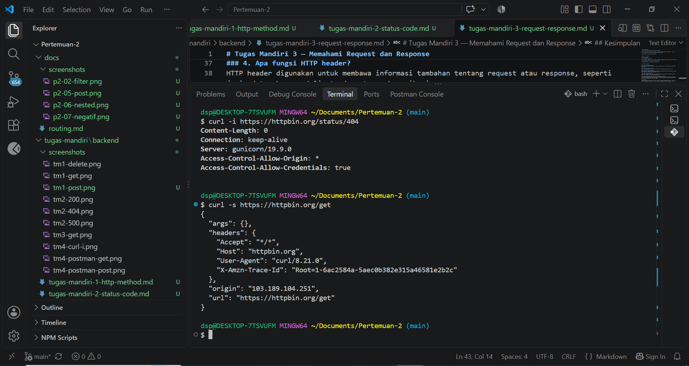

# Tugas Mandiri 4 — Pengujian API dengan Postman dan curl

## Pengujian API

Pengujian dilakukan menggunakan Postman dan `curl` dengan layanan HTTPBin.

| **No** | **Pengujian** | **Request** | **Hasil** |
| -----: | :------------ | :---------- | :-------- |
| 1 | Postman GET | `GET https://httpbin.org/get` | `200 OK`, server mengembalikan response JSON. |
| 2 | Postman POST | `POST https://httpbin.org/post` dengan JSON `{"nama":"Aura","kelas":"Informatika"}` | `200 OK`, server menerima dan mengembalikan data JSON. |
| 3 | curl `-i` | `curl -i https://httpbin.org/get` | `200 OK`, menampilkan HTTP header dan response body. |
| 4 | curl `-i` status 404 | `curl -i https://httpbin.org/status/404` | `404 NOT FOUND`, menunjukkan endpoint yang diminta tidak ditemukan. |
| 5 | curl `-s` | `curl -s https://httpbin.org/get` | Response body JSON tampil tanpa HTTP header dan progress meter. |
| 6 | curl `-i` | `curl -i https://httpbin.org/get` | Menampilkan HTTP header dan response body untuk dibandingkan dengan `curl -s`. |

## Screenshot Pengujian

### Postman GET

### Postman POST

### curl -i

### curl -s

## Perbandingan `curl -s` dan `curl -i`

### 1. Apa perbedaan hasil kedua perintah tersebut?
`curl -s` menampilkan response body dengan tampilan lebih sederhana, sedangkan `curl -i` menampilkan HTTP header sekaligus response body.

### 2. Apa fungsi opsi `-s`?
Opsi `-s` atau silent digunakan untuk menyembunyikan progress meter sehingga hasil response yang ditampilkan lebih bersih.

### 3. Apa fungsi opsi `-i`?
Opsi `-i` digunakan untuk menampilkan HTTP header beserta response body dari server.

### 4. Kapan Anda menggunakan masing-masing opsi?
`curl -s` digunakan ketika hanya membutuhkan isi response, sedangkan `curl -i` digunakan ketika ingin memeriksa status code dan informasi header dari server.

## Kesimpulan
Postman dan `curl` dapat digunakan untuk melakukan pengujian API HTTP. Postman memberikan tampilan visual yang lebih mudah digunakan, sedangkan `curl` dapat digunakan langsung melalui terminal. Penggunaan opsi `-s` dan `-i` dapat disesuaikan dengan informasi response yang ingin diperiksa.